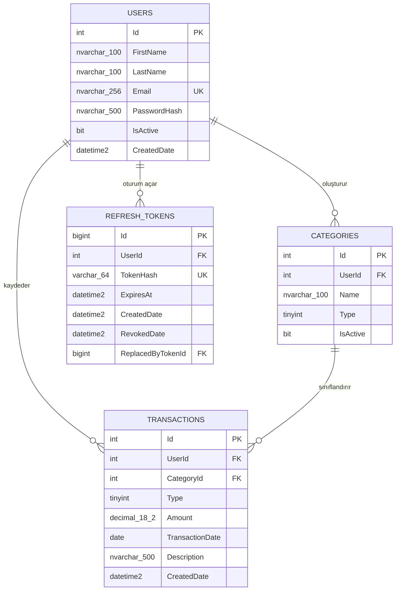

# Veritabanı Tasarımı

Bu belge, kişisel gelir-gider takip uygulamasının 2. gün veritabanı tasarımını içerir. Veritabanı olarak SQL Server kullanılacaktır. Proje kapsamı [gereksinim analizi raporunda](requirements-analysis.md), çalıştırılabilir başlangıç betiği ise [`database/schema.sql`](../database/schema.sql) dosyasındadır.

## İlişki diyagramı

## Tablolar

### Users

Kullanıcı hesabını tutar. E-posta benzersizdir. Parola açık metin olarak değil, yalnızca güvenli biçimde üretilmiş `PasswordHash` değeri olarak saklanır.

### Categories

Her kategori bir kullanıcıya aittir ve `UserId` ile `Users` tablosuna bağlanır. Aynı kullanıcı aynı türde aynı kategori adını yalnızca bir kez oluşturabilir. `Type` değerleri `1 = Income`, `2 = Expense` şeklindedir.

### Transactions

Gelir ve giderler ayrı tablolara bölünmez. İkisi de bu tabloda tutulur ve `Type` alanıyla ayrılır. Her işlem bir kullanıcıya ve o kullanıcıya ait, aynı türdeki bir kategoriye bağlanır. `Amount` her zaman pozitif olmalıdır.

### RefreshTokens

JWT access token süresi dolduğunda oturumu güvenli biçimde yenilemek için kullanılır. Ham refresh token yerine SHA-256 ile üretilmiş 64 karakterlik `TokenHash` değeri saklanır. İptal ve token yenileme zinciri `RevokedDate` ile `ReplacedByTokenId` üzerinden izlenir.

## Temel ilişkiler

- Bir kullanıcının birden fazla kategorisi olabilir.
- Bir kullanıcının birden fazla gelir-gider işlemi olabilir.
- Bir kullanıcının farklı cihaz veya oturumlar için birden fazla refresh token kaydı olabilir.
- Bir kategorinin birden fazla işlemi olabilir.
- Bir işlem yalnızca kendi kullanıcısına ait ve işlemle aynı türdeki kategoriye bağlanabilir.

## Planlanan sorgular

- Aylık grafik için yeni tablo oluşturulmaz; `Transactions` tablosu ay ve `Type` bazında gruplanır.
- Sayfalama için yeni tablo oluşturulmaz; `Transactions` sorgusunda sıralama ile `Skip/Take` uygulanır.
- Toplam gelir, gider ve bakiye kullanıcının `Transactions` kayıtlarından hesaplanır.

## Tasarım kararları

- Para değerlerinde kayan nokta hatalarını önlemek için `decimal(18,2)` kullanılır.
- Geçmiş veriler korunacağı için kullanıcılar ve kategoriler `IsActive` ile pasifleştirilir.
- Foreign key alanlarında otomatik toplu silme kullanılmaz.
- Veritabanı tarafından oluşturulan zamanlar UTC olarak saklanır.
- Entity Framework Core migration'ı 5. gün oluşturulacaktır; `schema.sql` 2. gün tasarımının SQL Server karşılığı ve manuel doğrulama betiğidir.
